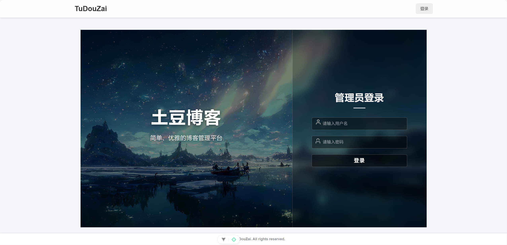
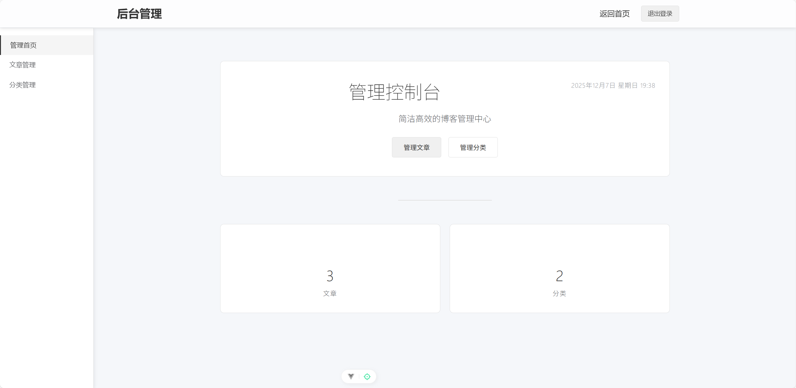
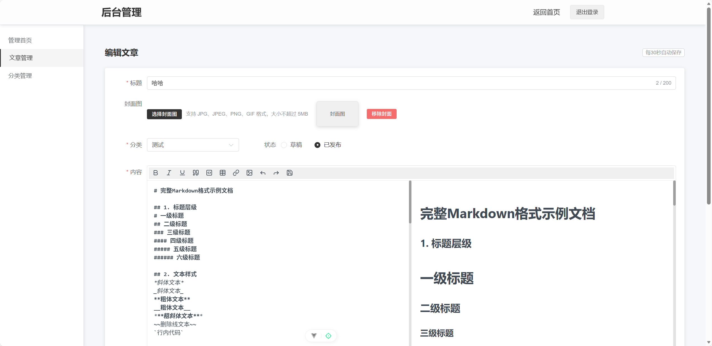
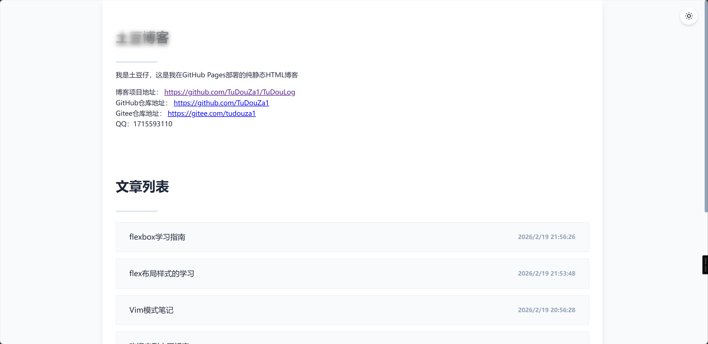

## 为什么要写这个博客项目

之前写过Spring Boot + Vue版本的个人博客，但是前端很多代码都是AI写的。 所以想自己从0开始写个能访问的静态博客。
刚开始是打算用纯HTML+CSS+JS写，但是发现耦合度太高了，最后还是选择使用Vue来写，顺便还能学一学

### 第一代博客

[第一代博客的项目地址](https://gitee.com/tudouza1/tudou-blog)

### 第二代博客

[第二代博客的项目地址](https://github.com/TuDouZa1/TuDouLog)

